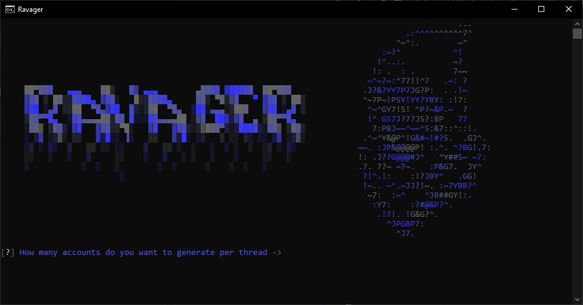

-----

<p align="center">

</p>

-----

### <p align="center">☠ Ravager ☠</p>

<p align="center" >
    <br>
    Before you read anything else, If you are looking for the <strong>BEST</strong> account generators check out <a href="https://discord.gg/NNzMbvzEeB">SteamGen</a> for cheap and fully autonomous account generators!
    <br><br>
    Ravager is a powerful tool designed to automate the creation of Discord accounts. By leveraging multiple undetected webdriver instances and employing bypass methods. With its simple and efficient interface, users can quickly generate multiple accounts for various purposes.
    <br><br>
    ⚠ NOT FULLY FINISHED ⚠
</p>

-----

### <p align="center">⚒ Usage ⚒<p>

<p align="center">
    <br>
    1. Run the script in a Python environment<br><br>
    2. Follow the prompts to enter the desired number of accounts to generate per thread and the number of threads to use.<br><br>
    3. Choose whether to use proxies or not (currently disabled in the code).<br><br>
    4. Select either Selenium or Undetected for browser automation.<br><br>
    5. The script will then start generating Discord accounts.<br><br>
    <p align="center">
      
    </p>
</p>

----

### <p align="center">🧬 Installation 🧬</p>

<p align="center">
  Install Python: If you don't have Python installed, download and install it from the official Python website (https://www.python.org).
  <br><br>
  Install required libraries: The script relies on several external libraries. You can install them using pip, the Python package installer. Open a terminal or command prompt and run the following command:
</p>

```python
pip install pystyle art selenium_profiles selenium-injector undetected-browser
```

<p align="center">
  This will install the necessary libraries for running the script.
</p>

----

### <p align="center">⛑ How it works ⛑</p>
<p align="center">
    1. The script first imports the required libraries and defines some variables and functions.
    <br><br>
    2. The main() function is called, which displays a banner and prompts the user for input regarding the number of accounts and threads, as well as the choice of browser automation library.
    <br><br>
    3. Based on the user's input, the selenium() function is called for each thread. This function initializes the browser driver (Selenium or Undetected) and starts the browser.
    <br><br>
    4. Within the selenium() function, the script retrieves an email address from a text file, generates a random password and username, and enters the registration information on the Discord registration page using the browser automation library.
    <br><br>
    5. If successful, the script waits for the account creation process to complete and verifies that the account has been successfully created.
    <br><br>
    6. The process continues until the desired number of accounts is generated or an error occurs.
    <br><br>
    7. The generated accounts can then be used for various purposes.
    <br>
</p>

----

### <p align="center">📌 Disclaimer 📌</p>

<p align="center">
    Please use this program only for educational purposes.
    <br><br>
    It is not meant to be used in any malicious way, and I decline any responsibility for what you do with it.
    <br><br>
</p>

-----
